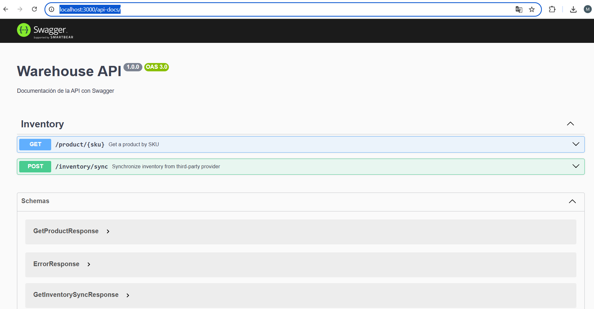
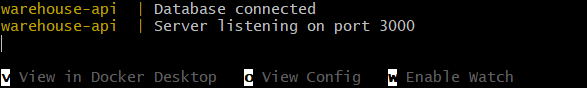
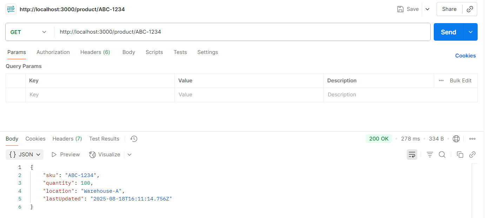
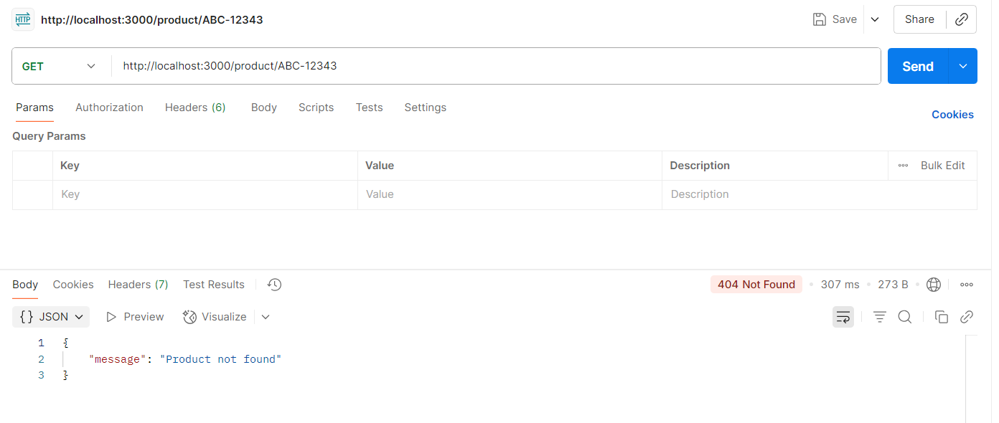
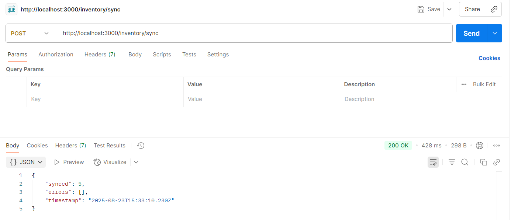

## Design and architectural decisions.
Based on the test requirements, this app is done with:
- TypeScript
- JavaScript
- Node.js
- Express.js
- PostgreSQL
### Types
In this route we defined the types needed for the api's responses. 
### Routes & Controller
In the route src/routes/routes.ts, there are defined two routes based on the test description. Each one points one method at the api controller, src/controllers/api.ts. Each method inside the controller has also the description for the API's documentation in Swagger.
### Mock Service Worker
For the sync route, we created a mock server to mock the response of a fake HTTP route. I've defined a route with a handler. This handler is used to mock a GET request to a fake external WMS API, returning a static JSON response from mock-inventory.json.
### Database
As we can see at the route src/db/config.ts, the config database file, we are using a postgreSQL database system with three schemas: Provider, Product and Stock.
#### Sequelize
As ORM we are using sequelize, based on models' definitions. It features solid transaction support, relations, eager and lazy loading, read replication and more.
#### Models
To model the application, we have defined three models:

- Provider, related to Product in a one-to-many (1:N) relationship. The provider's name is set as unique.

- Product, related to Provider in a many-to-one (N:1) relationship. The sku field is defined as a unique value.

- Stock, related to Product in a one-to-one (1:1) relationship. The product ID in this table is also unique.

## API's documentation
Once the app is running, if we access the route http://localhost:3000/api-docs/ we will have the API's documentation created in Swagger:



## Set up and Execution instruction

- To set up and execute our application, we created one container for each service, two services in total. In our docker-compose.services.yml file we can see them:
    - One image for our database, with an official image. We can appreciate it while it's setting up and executing as we can see where the image comes from.
    - One image for our application. Connected to the previous image with the access url defined in our .env file.

To set up and execute the app developed, it is needed to install docker. Here is the official guide:
https://www.docker.com/get-started/ 

Once you've installed docker and run it, in the root's directory path, you should execute the following command:
```bash
docker-compose -f docker-compose.services.yml up --build
```

When the deployment finishes and the application is running, we should see this message in our console:


After that, we can access to our Api's endpoints, take into account that during our deployment we added some seeders to fullfil the database with some data. Here we attach some results examples:




